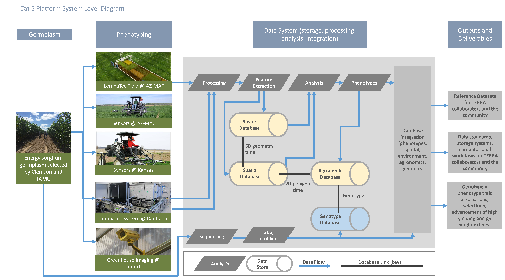

# Background

The ARPA-E TERRA Reference Team will produce data and develop a data storage and computing pipeline called "TERRA-REF". 
TERRA-REF will provide researchers with access to direct measurements and sensor observations, derived plant phenotypes, and a high performanceting environment. 
These data will be used to predict yield and stress resistance of diverse Sorghum lines in field- and greenhouse- based trials.

The ARPA-E TERRA program aims to transform plant breeding by using remote sensing to quantify plant traits that predict the yield potential and stress resistance of individual plants in breeding trials. Breeding is currently limited by the speed at which phenotypes can be measured, and the information that can be extracted from these measurements. Current methods include measuring leaf thickness with a caliper or height with a meter stick. More sophisticated measurements do not scale to the thousands or tens of thousands of individual plants that need to be evaluated in a breeding program. We will be providing data that can be used by all researchers in this program to select plants for breeding based on plant architecture, carbon uptake, tissue chemistry, water use, and other features that can be inferred from sensor data.  

## Data Sources

The data processing system proposed here will deliver reference phenotyping data of unprecedented quality and quantity and analytics resources that will drive improved breeding of new high-yielding Sorghum cultivars. This data processing system will facilitate data sharing and re-use of data by providing metadata, provenance for derived data sets, and standardized data processing workflows.

We will develop a data storage and computing system that provides researchers with access to all of the `raw' data and derived plant phenotypes (traits). Most of the data volume will come from a [Lemnatec Scanalyzer Field System](http://www.lemnatec.com/products/hardware-solutions/scanalyzer-field/) platform  USDA research station in Maricopa, Arizona, a [Lemnatec greenhouse phenotyping system] (https://www.danforthcenter.org/scientists-research/core-technologies/phenotyping) at the Donald Danforth Plant Science Center,  and aerial, ground, and tractor-based sensors at Arizona and Kansas.

### Lemnatec Field system:

<iframe width="560" height="315" src="https://www.youtube.com/embed/ZjWxqqRynJg?rel=0&amp;showinfo=0" frameborder="0" allowfullscreen></iframe>

### Lemnatec Indoor system at Danforth:

<iframe width="560" height="315" src="https://www.youtube.com/embed/QCgLuIqiC9E?rel=0&amp;showinfo=0" frameborder="0" allowfullscreen></iframe>

## Data Products

## Computing Pipeline
