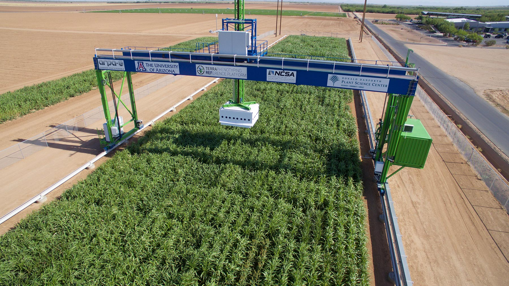
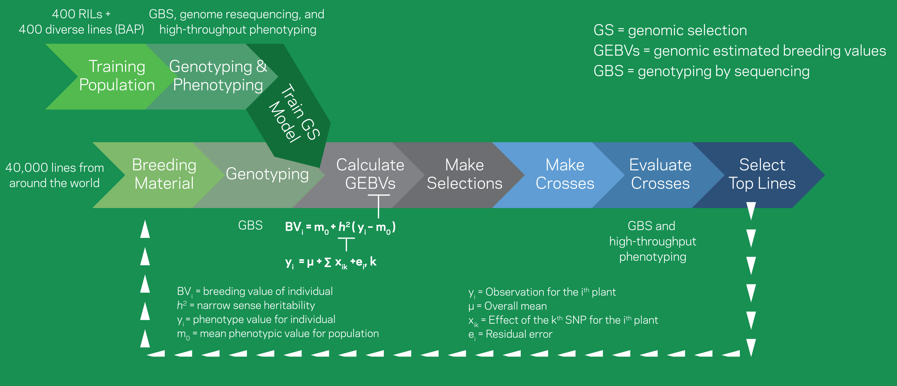
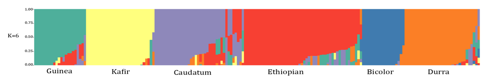

# Scientific Objectives

## Combining advanced sensing with novel analytical approaches to accelerate breeding

The [ARPA-E](https://arpa-e.energy.gov/)-funded [Transportation Energy Resources from Renewable Agriculture Phenotyping Reference Platform](http://terraref.org/) \(TERRA-REF\) program aims to transform plant breeding by using remote sensing to quantify plant traits such as plant architecture, carbon uptake, tissue chemistry, water use, and other features to predict the yield potential and stress resistance of 400+ diverse Sorghum lines.

## Conducting high-throughput phenotyping to connect discoveries to field performance

Breeding is currently limited by the speed at which phenotypes can be measured, and the information that can be extracted from these measurements. Current instruments used to quantify plant traits do not scale to the thousands or tens of thousands of individual plants that need to be evaluated in a breeding program. The TERRA-REF field scanner system scans over 1 acre of plants, collecting thousands of daily measurements throughout the growing season that are used to determine plant phenotypes and inform breeding decisions.

The field level phenotypic data combined with the genomic data is helping us to identify the differences between each line and the reference genome sequence for sorghum. We are using bioinformatics and quantitative genetics to characterize the observed genetic variation and identify genomic regions controlling biomass, plant architecture, and photosynthetic traits.

## Using large-scale genome sequencing to drive phenotype-genotype associations and gene discovery

There is enormous potential for sorghum crop improvement. There are 50,000 sorghum accessions in the U.S. germplasm collection and most are unused and unstudied. TERRA-REF is analyzing a sorghum bioenergy association panel \(BAP\) that includes diverse sweet and biomass lines from all five sorghum races. The BAP captures geographic, racial, and genomic diversity.

TERRA-REF has already sequenced 384 of the lines with an average sequence coverage of 20x per line. Genome-wide association studies \(GWAS\) are now underway.

## Providing reference quality data as a community resource

TERRA-REF is developing a data storage and computing system that provides researchers with access to all of the ‘raw’ data and derived plant phenotypes \(traits\). Data from sensors at a variety of locations across the US will be transferred to one location.

The reference data will facilitate data sharing and re-use of data by providing metadata, provenance for derived data sets, and standardized data processing workflows. It will include geospatial infrastructure for efficiently querying and transforming key datasets and tools that enable researchers to access, archive, use, and contribute data products. The technical documentation for this data pipeline is detailed in this book.

The data storage and computing system provides researchers with access to the reference phenotyping data and analytics resources using a high performance computing environment. The reference phenotyping data includes direct measurements and sensor observations, derived plant phenotypes, and genetic and genomic data.

Our objectives are to ensure that the software and data in the reference data and computing pipeline are interoperable, reusable, extensible, and understandable. Providing clear definitions of common formats will make it easier to analyze and exchange data and results.

