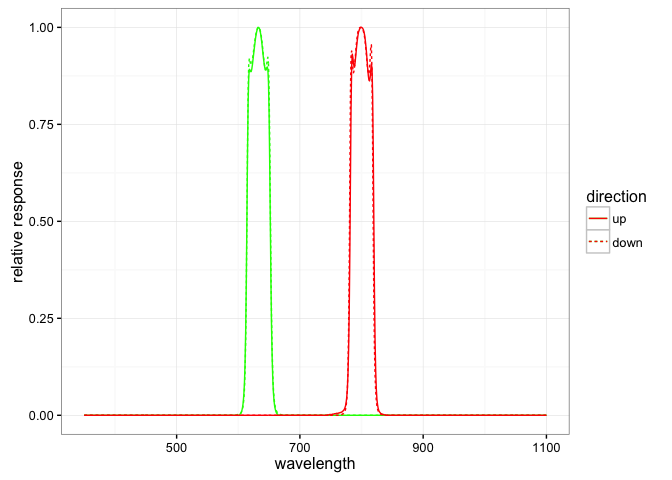

Introduction
============

This tutorial will demonstrate how to access sensor metadata from within
R. All of the sensor metadata is public, and can be queried via the API
using the url
`https://terraref.ncsa.illinois.edu/clowder/api/datasets/<id>/metadata.jsonld`.

For further information of the Sensor Metadata see

Avaialble Sensor metadata
-------------------------

    sensor_datasets <- jsonlite::fromJSON("data/sensor_metadata_datasets.json")
    knitr::kable(sensor_datasets[,c(2,3,1)])

<table>
<thead>
<tr class="header">
<th align="left">name</th>
<th align="left">description</th>
<th align="left">id</th>
</tr>
</thead>
<tbody>
<tr class="odd">
<td align="left">SphereOptics Zenith Polymer</td>
<td align="left">Information about the SphereOptics Zenith Polymer diffuse reflectance target.</td>
<td align="left">5818bb544f0c63f2a8d20963</td>
</tr>
<tr class="even">
<td align="left">Labsphere Spectralon Diffuse Color Standards</td>
<td align="left">Information about the Labsphere Spectralon Diffuse Color standards (8 targets)</td>
<td align="left">5817c7c84f0c63f2a8ca5e6c</td>
</tr>
<tr class="odd">
<td align="left">LemnaTec Scanalyzer Field</td>
<td align="left">General information about the LemnaTec Scanalyzer Field platform. Please see individual device and sensor datasets.</td>
<td align="left">58178ee54f0ce77b66561602</td>
</tr>
<tr class="even">
<td align="left">Thies Clima Weather Station</td>
<td align="left">Information about the Thies Clima weather station.</td>
<td align="left">58178a744f0ce77b6655d38a</td>
</tr>
<tr class="odd">
<td align="left">Ocean Optics Spectrometer</td>
<td align="left">Information about the OceanOptics spectrometer.</td>
<td align="left">581789ca4f0ce77b6655d0f5</td>
</tr>
<tr class="even">
<td align="left">Fraunhofer 3D Scanner</td>
<td align="left">Information about the Fraunhofer 3D scanner. This device is used to measure 3D surface topology.</td>
<td align="left">581789af4f0ce77b6655d094</td>
</tr>
<tr class="odd">
<td align="left">LemnaTec PSII</td>
<td align="left">Information about the LemnaTec PSII camera. This camera is used to measure red light emitted by chlorophyll fluorescence.</td>
<td align="left">581789834f0ce77b6655cee4</td>
</tr>
<tr class="even">
<td align="left">Skye PRI</td>
<td align="left">Information about the Skye PRI sensor.</td>
<td align="left">581789524f0ce77b6655ccf9</td>
</tr>
<tr class="odd">
<td align="left">Apogee PAR</td>
<td align="left">Information for the Apogee Instruments photosynthetically active radiation (PAR) sensor.</td>
<td align="left">581788344f0ce77b6655bf23</td>
</tr>
<tr class="even">
<td align="left">Vaisala Carbocap</td>
<td align="left">Information for the Vaisala Carbocap CO2 Probe</td>
<td align="left">581787d94f0ce77b6655b819</td>
</tr>
<tr class="odd">
<td align="left">FLIR Thermal Camera</td>
<td align="left">Information about the FLIR A615 thermal infrared imager.</td>
<td align="left">5817877a4f0ce77b6655b320</td>
</tr>
<tr class="even">
<td align="left">Skye NDVI</td>
<td align="left">Information about the Skye NDVI sensor. This sensor is used for nitrogen content assessment.</td>
<td align="left">581787524f0ce77b6655b2c7</td>
</tr>
<tr class="odd">
<td align="left">Prosilica RGB Camera</td>
<td align="left">Information about the Prosilica GT3300 8 Megapixel CCD camera. This device is used for stereo RGB imaging.</td>
<td align="left">5817873d4f0ce77b6655b269</td>
</tr>
<tr class="even">
<td align="left">Headwall VNIR</td>
<td align="left">Information about the Headwall Photonics VNIR Hyperspectral imager.</td>
<td align="left">581787264f0ce77b6655b125</td>
</tr>
<tr class="odd">
<td align="left">Headwall SWIR</td>
<td align="left">Information about the Headwall Photonics SWIR Hyperspectral imager.</td>
<td align="left">5817870c4f0ce77b6655aecd</td>
</tr>
<tr class="even">
<td align="left">Crop Circle</td>
<td align="left">Information about the Holland Scientific Crop Circle ACS-430 active crop canopy sensor.</td>
<td align="left">580361164f0c4a438cbb546c</td>
</tr>
</tbody>
</table>

### Looking at Skye NDVI meta-data

    ndvi_metadata <- jsonlite::fromJSON("https://terraref.ncsa.illinois.edu/clowder/api/datasets/581787524f0ce77b6655b2c7/metadata.jsonld")

    knitr::kable(t(ndvi_metadata$content[-21]), col.names = '')

<table>
<tbody>
<tr class="odd">
<td align="left">sensor manufacturer</td>
<td align="left">Sky Instruments Ltd</td>
</tr>
<tr class="even">
<td align="left">sensor product name</td>
<td align="left">SKR 1860 DA</td>
</tr>
<tr class="odd">
<td align="left">sensor serial number facing up</td>
<td align="left">45951</td>
</tr>
<tr class="even">
<td align="left">sensor serial number facing down</td>
<td align="left">45952</td>
</tr>
<tr class="odd">
<td align="left">sensor description</td>
<td align="left">4 channel amplified sensor</td>
</tr>
<tr class="even">
<td align="left">channel 1 wavelength facing sky nm</td>
<td align="left">633</td>
</tr>
<tr class="odd">
<td align="left">channel 1 bandwidth facing sky nm</td>
<td align="left">38</td>
</tr>
<tr class="even">
<td align="left">channel 4 wavelength facing sky nm</td>
<td align="left">800.7</td>
</tr>
<tr class="odd">
<td align="left">channel 4 bandwidth facing sky nm</td>
<td align="left">38.5</td>
</tr>
<tr class="even">
<td align="left">channel 1 wavelength facing ground nm</td>
<td align="left">633.2</td>
</tr>
<tr class="odd">
<td align="left">channel 1 bandwidth facing ground nm</td>
<td align="left">38.3</td>
</tr>
<tr class="even">
<td align="left">channel 4 wavelength facing ground nm</td>
<td align="left">799.7</td>
</tr>
<tr class="odd">
<td align="left">channel 4 bandwidth facting ground nm</td>
<td align="left">38.4</td>
</tr>
<tr class="even">
<td align="left">Date of calibration</td>
<td align="left">2015.09.01</td>
</tr>
<tr class="odd">
<td align="left">calibration certificate</td>
<td align="left">handed to UA Maricopa</td>
</tr>
<tr class="even">
<td align="left">Manufacturer advice</td>
<td align="left">recalibration within two years</td>
</tr>
<tr class="odd">
<td align="left">location in gantry system</td>
<td align="left">top of gantry, facing up, camera box, facing ground</td>
</tr>
<tr class="even">
<td align="left">location in camera box x m</td>
<td align="left">0.33</td>
</tr>
<tr class="odd">
<td align="left">location in camera box y m</td>
<td align="left">2.50</td>
</tr>
<tr class="even">
<td align="left">analog digital interface, all four sensors</td>
<td align="left">WAGO 750-478</td>
</tr>
</tbody>
</table>

#### RSR curve

    ndvi_up_rsr <- cbind(direction = 'up',
                         bind_rows(lapply(ndvi_metadata$content$rsr$up, unlist)))
    ndvi_down_rsr <- cbind(direction = 'down', 
                        bind_rows(lapply(ndvi_metadata$content$rsr$down, unlist)))
    ndvi_rsr <- rbind(ndvi_up_rsr, ndvi_down_rsr) 
    ggplot(data = ndvi_rsr, aes(x = wavelength, linetype = direction), alpha = 0.4) +
      geom_line(aes(y = ch1), color = 'green') + 
      geom_line(aes(y = ch4), color = 'red') +
      ylab('relative response')

