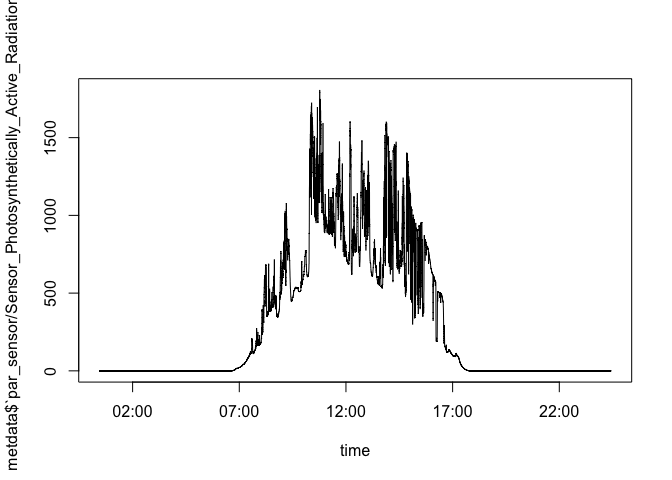
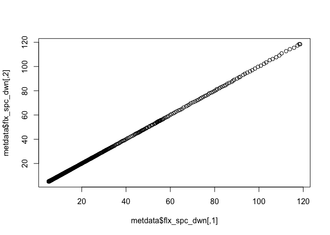

First concatenate hourly files

    ncrcat *.nc 2016-10-28_environmentlogger.nc

    library(ncdf4)
    library(ncdf.tools)
    library(lubridate)

    ## 
    ## Attaching package: 'lubridate'

    ## The following object is masked from 'package:base':
    ## 
    ##     date

    ncfile <- 'data/2016-10-28_environmentlogger.nc'
    oct28 <- nc_open(ncfile)

    metdata <- list()
    for(var in c(names(oct28$dim), names(oct28$var))){
      metdata[[var]] <- ncvar_get(oct28, var)
    }
    lapply(metdata, function(x) print(paste(class(x), dim(x))))

    ## [1] "array 17139"
    ## [1] "integer "
    ## [1] "array 1024"
    ## [1] "array 1024"
    ## [1] "matrix 1024"  "matrix 17139"
    ## [1] "numeric "
    ## [1] "numeric "
    ## [1] "numeric "
    ## [1] "matrix 1024"  "matrix 17139"
    ## [1] "array 17139"
    ## [1] "array 17139"
    ## [1] "array 17139"
    ## [1] "array 17139"
    ## [1] "array 17139"
    ## [1] "array 17139"
    ## [1] "array 17139"
    ## [1] "array 17139"
    ## [1] "array 17139"
    ## [1] "array 17139"
    ## [1] "array 17139"
    ## [1] "array 17139"
    ## [1] "array 17139"
    ## [1] "array 17139"
    ## [1] "array 17139"
    ## [1] "array 17139"
    ## [1] "array 17139"
    ## [1] "array 17139"
    ## [1] "array 17139"
    ## [1] "array 17139"
    ## [1] "array 17139"

    ## $time
    ## [1] "array 17139"
    ## 
    ## $wvl_lgr
    ## [1] "integer "
    ## 
    ## $wvl_dlt
    ## [1] "array 1024"
    ## 
    ## $flx_sns
    ## [1] "array 1024"
    ## 
    ## $flx_spc_dwn
    ## [1] "matrix 1024"  "matrix 17139"
    ## 
    ## $flx_dwn
    ## [1] "numeric "
    ## 
    ## $time_integration
    ## [1] "numeric "
    ## 
    ## $area_sensor
    ## [1] "numeric "
    ## 
    ## $`spectrometer/spectrum`
    ## [1] "matrix 1024"  "matrix 17139"
    ## 
    ## $`spectrometer/maxFixedIntensity`
    ## [1] "array 17139"
    ## 
    ## $`weather_station/temperature`
    ## [1] "array 17139"
    ## 
    ## $`weather_station/raw_temperature`
    ## [1] "array 17139"
    ## 
    ## $`weather_station/airPressure`
    ## [1] "array 17139"
    ## 
    ## $`weather_station/raw_airPressure`
    ## [1] "array 17139"
    ## 
    ## $`weather_station/brightness`
    ## [1] "array 17139"
    ## 
    ## $`weather_station/raw_brightness`
    ## [1] "array 17139"
    ## 
    ## $`weather_station/precipitation`
    ## [1] "array 17139"
    ## 
    ## $`weather_station/raw_precipitation`
    ## [1] "array 17139"
    ## 
    ## $`weather_station/sunDirection`
    ## [1] "array 17139"
    ## 
    ## $`weather_station/raw_sunDirection`
    ## [1] "array 17139"
    ## 
    ## $`weather_station/windVelocity`
    ## [1] "array 17139"
    ## 
    ## $`weather_station/raw_windVelocity`
    ## [1] "array 17139"
    ## 
    ## $`weather_station/relHumidity`
    ## [1] "array 17139"
    ## 
    ## $`weather_station/raw_relHumidity`
    ## [1] "array 17139"
    ## 
    ## $`weather_station/windDirection`
    ## [1] "array 17139"
    ## 
    ## $`weather_station/raw_windDirection`
    ## [1] "array 17139"
    ## 
    ## $`co2_sensor/sensor_co2`
    ## [1] "array 17139"
    ## 
    ## $`co2_sensor/raw_sensor_co2`
    ## [1] "array 17139"
    ## 
    ## $`par_sensor/Sensor_Photosynthetically_Active_Radiation`
    ## [1] "array 17139"
    ## 
    ## $`par_sensor/raw_Sensor_Photosynthetically_Active_Radiation`
    ## [1] "array 17139"

    lapply(metdata, dim)

    ## $time
    ## [1] 17139
    ## 
    ## $wvl_lgr
    ## NULL
    ## 
    ## $wvl_dlt
    ## [1] 1024
    ## 
    ## $flx_sns
    ## [1] 1024
    ## 
    ## $flx_spc_dwn
    ## [1]  1024 17139
    ## 
    ## $flx_dwn
    ## NULL
    ## 
    ## $time_integration
    ## NULL
    ## 
    ## $area_sensor
    ## NULL
    ## 
    ## $`spectrometer/spectrum`
    ## [1]  1024 17139
    ## 
    ## $`spectrometer/maxFixedIntensity`
    ## [1] 17139
    ## 
    ## $`weather_station/temperature`
    ## [1] 17139
    ## 
    ## $`weather_station/raw_temperature`
    ## [1] 17139
    ## 
    ## $`weather_station/airPressure`
    ## [1] 17139
    ## 
    ## $`weather_station/raw_airPressure`
    ## [1] 17139
    ## 
    ## $`weather_station/brightness`
    ## [1] 17139
    ## 
    ## $`weather_station/raw_brightness`
    ## [1] 17139
    ## 
    ## $`weather_station/precipitation`
    ## [1] 17139
    ## 
    ## $`weather_station/raw_precipitation`
    ## [1] 17139
    ## 
    ## $`weather_station/sunDirection`
    ## [1] 17139
    ## 
    ## $`weather_station/raw_sunDirection`
    ## [1] 17139
    ## 
    ## $`weather_station/windVelocity`
    ## [1] 17139
    ## 
    ## $`weather_station/raw_windVelocity`
    ## [1] 17139
    ## 
    ## $`weather_station/relHumidity`
    ## [1] 17139
    ## 
    ## $`weather_station/raw_relHumidity`
    ## [1] 17139
    ## 
    ## $`weather_station/windDirection`
    ## [1] 17139
    ## 
    ## $`weather_station/raw_windDirection`
    ## [1] 17139
    ## 
    ## $`co2_sensor/sensor_co2`
    ## [1] 17139
    ## 
    ## $`co2_sensor/raw_sensor_co2`
    ## [1] 17139
    ## 
    ## $`par_sensor/Sensor_Photosynthetically_Active_Radiation`
    ## [1] 17139
    ## 
    ## $`par_sensor/raw_Sensor_Photosynthetically_Active_Radiation`
    ## [1] 17139

    days <- ncvar_get(oct28, varid = "time")
    oct28$dim$time$units

    ## [1] "days since 1970-01-01 00:00:00"

    time <- ymd("1970-01-01") + seconds(days * 24 * 60 * 60)

    plot(time, metdata$`par_sensor/Sensor_Photosynthetically_Active_Radiation`, type = 'l')

    plot(metdata$flx_spc_dwn)

