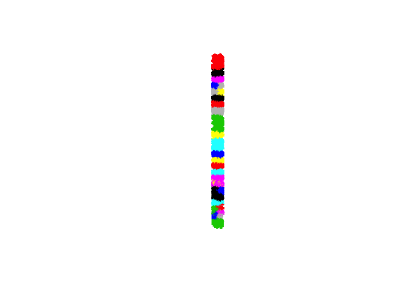
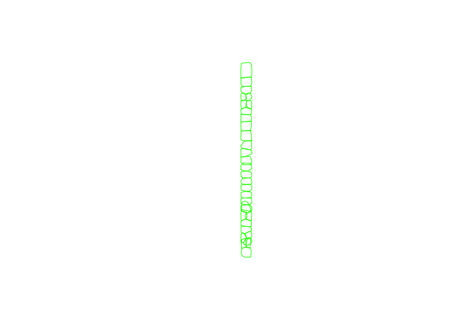
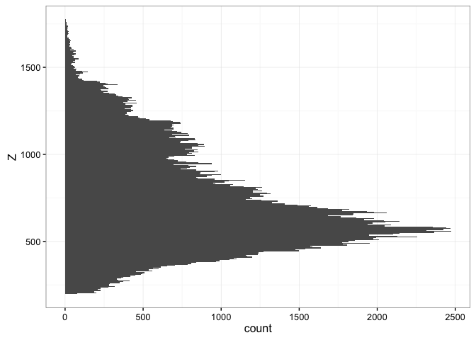
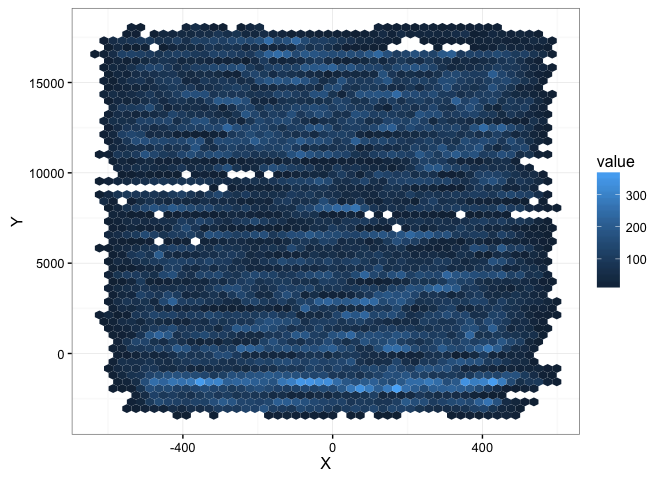

Based on documentation for the `readLiDAR` package

    library(rLiDAR) 
    library(ggplot2)
    library(dplyr)

    ## 
    ## Attaching package: 'dplyr'

    ## The following objects are masked from 'package:stats':
    ## 
    ##     filter, lag

    ## The following objects are masked from 'package:base':
    ## 
    ##     intersect, setdiff, setequal, union

    library(rgl)
    theme_set(theme_bw())
    # Importing LAS file:

    lasfile <- "~/terraref/documentation/tutorials/data/51458297-0d25-416a-91a5-a2f0ae1a1083__Top-heading-east_0.las"

    LAS <- readLAS(lasfile) %>% 
      as_data_frame %>% 
      mutate(Z = (Z - min(Z)))

    LAS_sample <- LAS %>% 
      filter(Z>200) %>% 
      sample_frac(size = 0.01)

    xyz <- LAS_sample[,1:3]
    # Getting LiDAR clusters
    set.seed(1)
    clLAS <- kmeans(xyz, 32)
    # Set the points id
    id <- as.factor(clLAS$cluster)

    xyzid <- cbind(xyz, id)

    library(rgl)
    open3d()

    ## glX 
    ##   1

    volumeList <- chullLiDAR3D(xyzid = xyzid, plotit = TRUE, col = 'forestgreen', alpha = 0.6)

    ## ................................

    plot3d(xyzid[,1:3], add=TRUE)

    summary(volumeList) # summary

    ##       Tree        crownvolume         crownsurface    
    ##  Min.   : 1.00   Min.   :2.269e+08   Min.   :2050764  
    ##  1st Qu.: 8.75   1st Qu.:3.149e+08   1st Qu.:2595369  
    ##  Median :16.50   Median :4.915e+08   Median :3343669  
    ##  Mean   :16.50   Mean   :5.211e+08   Mean   :3459616  
    ##  3rd Qu.:24.25   3rd Qu.:5.971e+08   3rd Qu.:3912425  
    ##  Max.   :32.00   Max.   :1.447e+09   Max.   :7232211

    xyid <- xyzid[,c("X", "Y", "id")]
    chullTrees <- chullLiDAR2D(xyid = xyid)

    ## ................................

     # Plotting the LiDAR convex hull
    library(sp)
    plot.new()
    plot(SpatialPoints(xyid[,1:2]),cex=0.5,col=xyid[,3])

    plot(chullTrees$chullPolygon, border = "green")

    # Get the ground-projected area of LiDAR convex hull

    chullList <- chullTrees$chullPolygon
    summary(chullList) # summary

    ## Object of class SpatialPolygonsDataFrame
    ## Coordinates:
    ##         min        max
    ## x  -623.070   598.3156
    ## y -3384.152 17989.1719
    ## Is projected: NA 
    ## proj4string : [NA]
    ## Data attributes:
    ##      TreeID           GPA         
    ##  Min.   : 1.00   Min.   : 393450  
    ##  1st Qu.: 8.75   1st Qu.: 520056  
    ##  Median :16.50   Median : 788020  
    ##  Mean   :16.50   Mean   : 775981  
    ##  3rd Qu.:24.25   3rd Qu.: 879470  
    ##  Max.   :32.00   Max.   :1877321

    ggplot(data = LAS_sample ) + 
      geom_histogram(aes(Z), bins = 300) + coord_flip()

    ggplot(data = LAS_sample) + 
      geom_hex(aes(X, Y), bins = 50)

