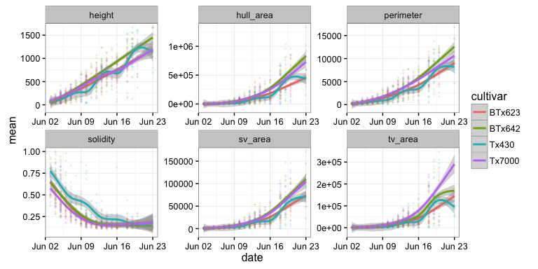

BETYdb
------

BETYdb stores trait data and agronomic metadata. An introduction to the
API is in ../betydb.md

Also see the full documentation for accessing data from BETYdb.

    terraref_betyurl <- "https://terraref.ncsa.illinois.edu/bety/"
    mykey = readLines(con = file('~/.betykey'))
    site <- betydb_site(id = 6000000866, betyurl = terraref_betyurl, key = mykey)

    sorghum_all <- betydb_search(query = 'Sorghum', 
                             betyurl = terraref_betyurl, 
                             key = mykey) 

    ## Warning: closing unused connection 5 (~/.betykey)

    #save(sorghum_all, file = '~/terraref/documentation/tutorials/data/sorghum_all.RData')
    #load('~/terraref/documentation/tutorials/data/sorghum_all.RData')

    sorghum <- sorghum_all %>% 
      select(author, date, scientificname, cultivar, entity, trait, mean, units, city, sitename)

    head(sorghum)

    ## # A tibble: 6 x 10
    ##           author        date  scientificname cultivar        entity
    ##            <chr>       <chr>           <chr>    <chr>         <chr>
    ## 1 Fahlgren, Noah 2014 Jun 16 Sorghum bicolor    Tx430 Fa001AB006947
    ## 2 Fahlgren, Noah 2014 Jun 16 Sorghum bicolor    Tx430 Fa001AB006947
    ## 3 Fahlgren, Noah 2014 Jun 16 Sorghum bicolor    Tx430 Fa001AB006947
    ## 4 Fahlgren, Noah 2014 Jun 16 Sorghum bicolor    Tx430 Fa001AB006947
    ## 5 Fahlgren, Noah 2014 Jun 16 Sorghum bicolor    Tx430 Fa001AB006947
    ## 6 Fahlgren, Noah 2014 Jun 16 Sorghum bicolor    Tx430 Fa001AB006947
    ## # ... with 5 more variables: trait <chr>, mean <dbl>, units <chr>,
    ## #   city <chr>, sitename <chr>

### Summary of Available Data

    ggplot(data = sorghum) + 
      geom_histogram(aes(x = mean), bins = 100) + 
      facet_wrap(~trait, scales = 'free')

### Danfoth Phenotyping Facility

    danforth <- sorghum %>% 
      filter(author == 'Fahlgren, Noah') %>% 
      mutate(date = lubridate::ymd(date))
      

    ggplot(data = danforth, aes(x = date, y = mean, color = cultivar)) +
      #geom_line(aes(y = mean, group = entity), alpha = 0.1) +
      geom_smooth() +
      geom_point(alpha = 0.1, size = 0.5) +
      facet_wrap(~trait, scales = 'free')

