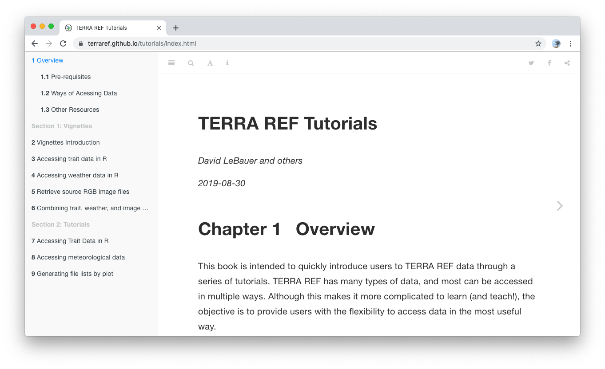
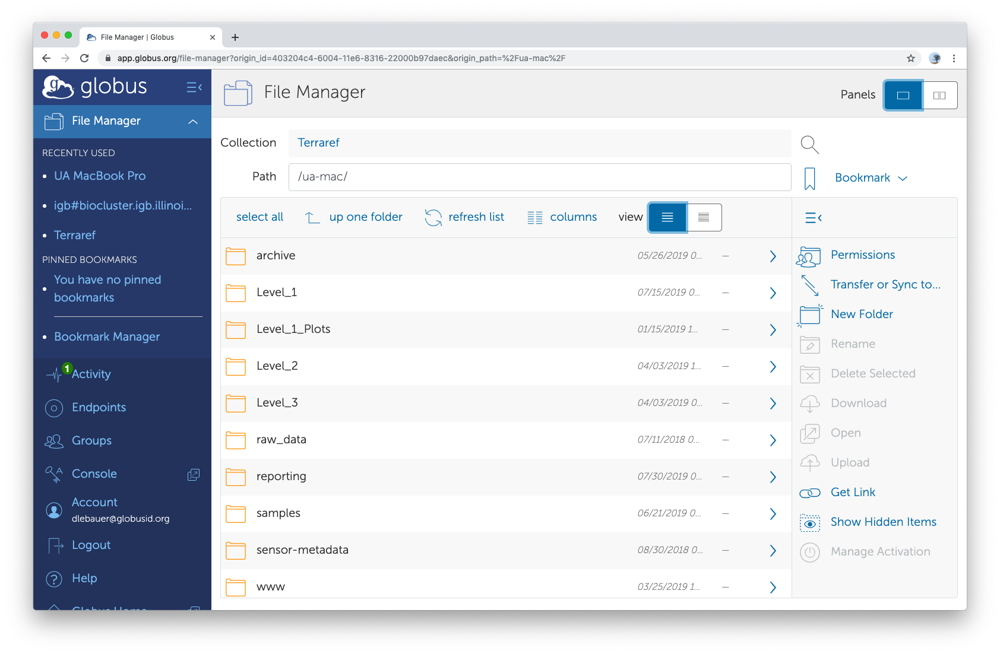
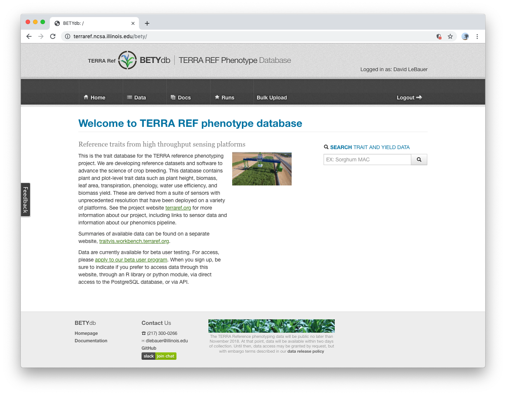
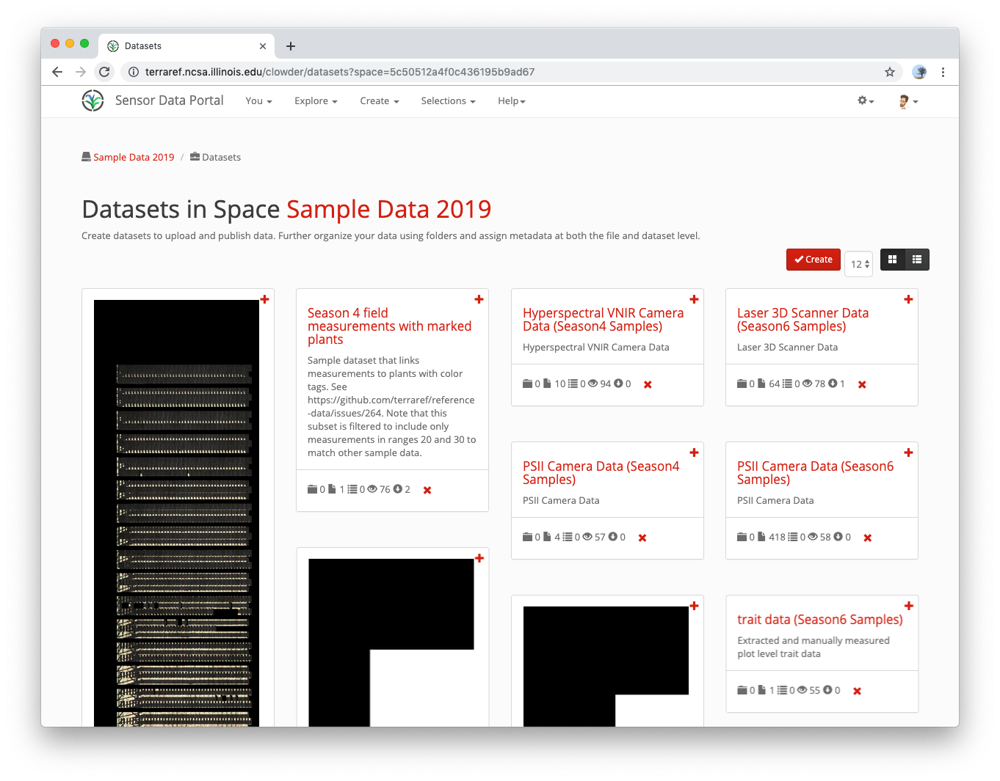
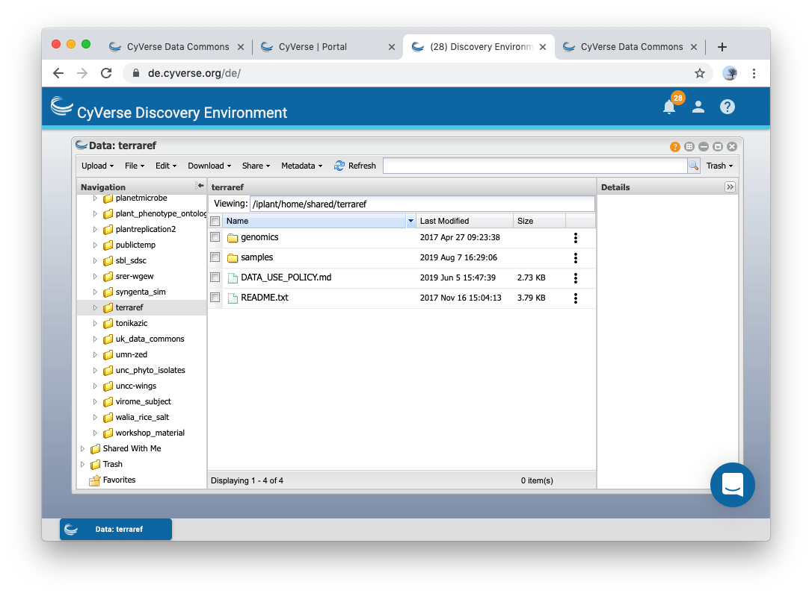
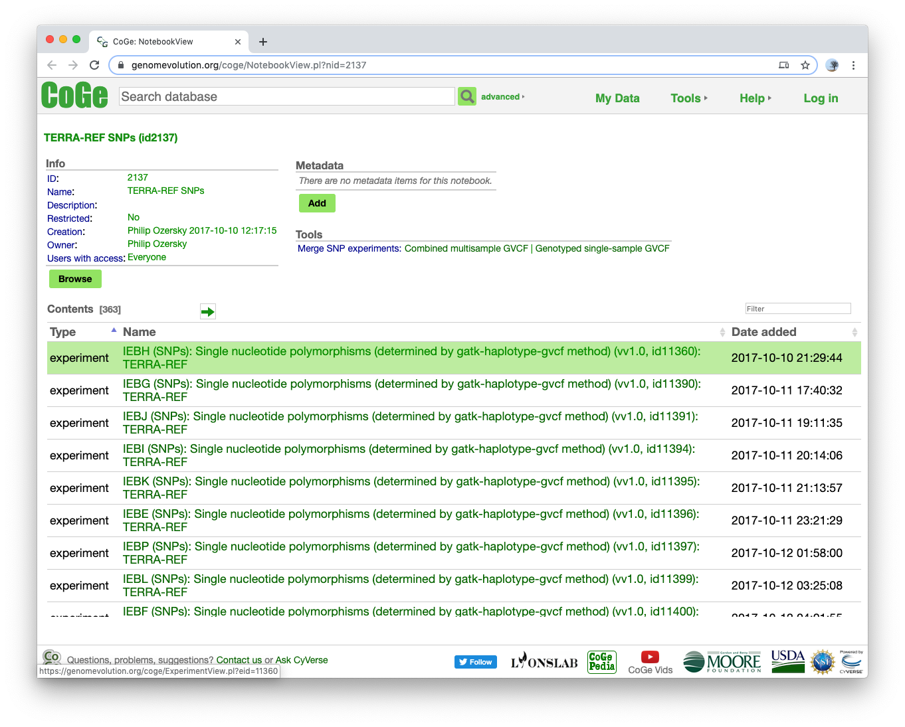

# How to Access Data

## Overview

TERRA-REF data can be accessed through many different interfaces: Globus, Clowder, BETYdb, CyVerse, and CoGe. Raw data is transfered to the primary compute pipeline using Globus Online. Data is ingested into Clowder to support exploratory analysis. The Clowder extractor system is used to transform the data and create derived data products, which are either available via Clowder or published to specialized services, such as BETYdb.

| Resource | Use | Web User Interface | API\* | clients |
| :--- | :--- | :--- | :--- | :--- |
| **Sensor Data** |  |  |  |  |
|   Globus | Browse directories; transfer large sensor files | globus.org \#TERRAREF endpoint | [docs.globus.org/api/](https://docs.globus.org/api/) | R, Python |
|   Clowder | Browse and Download small Sensor Data | terraref.org/clowder | [terraref.org/clowder/swaggerUI](https://terraref.org/clowder/swaggerUI) | Python |
| **Trait Data** |  |  |  |  |
|   BETYdb | Trait and Agronomic Metadata | terraref.org/bety | [terraref.org/bety/api/v1](https://terraref.org/bety/api/v1) and [terraref.org/brapi/v1/ui](https://terraref.org/brapi/v1/ui/) | R traits package, Python: terrautils; SQL: Postgres in Docker |
|   traitvis | View available trait data | terraref.org/traitvis | NA | NA |
| **Genomics Data** |  |  |  |  |
|   CyVerse | Download Genomics data | terraref.org/cyverse-genomics | yes |  |
|   CoGe | Download, process, visualize Genomics data | terraref.org/coge | [genomevolution.org/apidocs/](https://genomevolution.org/apidocs/) |  |
| **Other** |  |  |  |  |
| Tutorials | R and Python scripts for accessing data | terraref.org/tutorials | NA |  |
|   Advanced Search | Search across sensor and trait data | search.terraref.org \(under development\) | yes |  |

## Tutorials \(Recommended!\)

We have developed tutorials to provide users with both 'quick start' vignettes and more detailed introductions to TERRA REF datasets. Tutorials for accessing trait data, sensor data, and genomics data are organized by directory \("traits", "sensors", and "genomics"\).

The tutorials assume familiarity with or willingness to learn Python and / or R, and provide the greatest flexibility and access to available data.

These can be found at [terraref.org/tutorials](https://terraref.org/tutorials). 




## Globus: Browse and Transfer Files



Raw data is transferred to the primary TERRA-REF file system at the National Center for Computing Applications at the University of Illinois. 

Public domain data is available for Globus transfer via the [ncsa\#terra-public](https://app.globus.org/file-manager?origin_id=e8feaff4-96cd-11ea-bf90-0e6cccbb0103&origin_path=%2F). Non-public \(but available with permission\) data are at the  [\#Terraref](https://app.globus.org/file-manager?origin_id=403204c4-6004-11e6-8316-22000b97daec&origin_path=%2F) endpoint

Use Globus Online when you want to transfer data from the TERRA-REF system for local analysis.

See also Globus [Getting Started](https://docs.globus.org/how-to/get-started/)

#### Transferring data using Globus Connect:

The [Globus Connect](https://www.globus.org/globus-connect) service provides high-performance, secure, file transfer and synchronization between endpoints. It also allows you to securely share your data with other Globus users.

To access data via Globus, you must first have a Globus account and endpoint.

1. Sign up for Globus at [globus.org](https://www.globus.org/)
2. Download and install Globus Connect [Personal](https://www.globus.org/globus-connect-personal) or [Server.](https://www.globus.org/globus-connect-server)
3. Log into Globus [https://www.globus.org](https://www.globus.org/)
4. Add an endpoint for the destination \(e.g. your local computer\) [https://www.globus.org/app/endpoints/create-gcp](https://www.globus.org/app/endpoints/create-gcp)
5. Go to the 'transfer files' page: [https://www.globus.org/app/transfer](https://www.globus.org/app/transfer)
6. Select source
   * Endpoint: \#Terraref
   * Path: Navigate to the subdirectory that you want.
   * Select \(click\) a folder
   * Select \(highlight\) files that you want to download at destination
   * Select the endpoint that you set up above of your local computer or server
   * Select the destination folder \(e.g. /~/Downloads/\)
7. Click 'go'
8. Files will be transfered to your computer

**Requesting Access to unpublished data in TERRA-REF BETYdb:** 

To request access to unpublished data, send your Globus id to David LeBauer \(dlebauer@email.arizona.edu\) with 'TERRAREF Globus Access Request' in the subject.

1. fill out the terraref.org/beta user form
2. email dlebauer@email.arizona.edu with your globusid to request access.

## **BETYdb: Trait Data and Agronomic Metadata**

[BETYdb](https://github.com/terraref/documentation/tree/56f669dc870b3c3921bfc029914545574e70f8df/user/%7B%7Bbook.BETYdb_URL%7D%7D) is used to manage and distribute agricultural and ecological data. It contains phenotype and agronomic data including plot locations and other geolocations of interest \(e.g. fields, rows, plants\). 

BETYdb contains the derived trait data with plot locations and other information associated with agronomic experimental design.

### Accessing data in R

The easiest way to access data is to use the [R traits package](https://cran.r-project.org/web/packages/traits/index.html). This is documented in the [tutorials](https://terraref.org/tutorials).




**Requesting Access to unpublished data in TERRA-REF BETYdb:** 

1. fill out the [terraref.org/beta](https://terraref.org/beta) user form
2. create an account at the TERRA-REF BETYdb: [terraref.org/bety](https://terraref.org/bety) \(_not_ betydb.org\)
3. email dlebauer@email.arizona.edu for your account to be approved.

### Using SQL and PostGIS with Docker \(Advanced Users\)

The fastest and most comprehensive way to access the database using SQL and other database interfaces \(such as the R package dplyr interface described below, or GIS programs described in . You can run an instance of the database using docker, as described below

This is how you can access the TERRA REF trait database. It requires that you install the Docker software on your computer.

The easiest way to get the entire database, including metadata. Assuming you are familiar with the  Postgres and / or the R dbplyr library documentation. See the [TERRA REF Tutorials](https://terraref.org/tutorials) terraref.org/tutorials, the [BETYdb Data Access guide](https://pecan.gitbook.io/betydb-data-access/) for additional examples.

```text
#git clone https://github.com/terraref/data-paper 
cd data-paper/code/betydb_docker 
docker-compose up -d postgres
docker-compose run --rm bety initialize
docker-compose run --rm bety sync
```

#### psql

```text
psql -d bety -U bety -W bety
```

#### R

```text
library(dplyr)
bety_src <- src_postgres(dbname = "bety", 
                         password = 'bety',
                         host = 'localhost', 
                         user = 'bety',
                         port = 5433)
```

#### GIS software

Interested researchers can access BETYdb directly from GIS software such as ESRI ArcMap and QGIS.  
In some cases direct access can simplify the use of spatial data in BETYdb. ****See the Appendix [Accessing BETYdb with GIS Software](../appendix/accessing-betydb-with-gis-software.md) for more information.

\*\*\*\*

## Clowder: Sensor Data and Metadata Browser

Clowder is an active data repository designed to enable collaboration around a set of shared datasets. TERRAREF uses Clowder to organize, annotate, and process data generated by phenotyping platforms. Datafiles are available via the Clowder [web interface](http://terraref.ncsa.illinois.edu/clowder/spaces) or [API](https://clowder.ncsa.illinois.edu/swagger/?url=https://terraref.ncsa.illinois.edu/clowder/swagger).

Clowder is the used to organize, annotate, and process raw data generated by the field scanner and other phenotyping platforms. It also stores information about sensors. Learn more about Clowder software from [https://clowderframework.org](https://clowderframework.org/)



#### **Data organization in Clowder**

Data is organized into **spaces, collections,** and **datasets**, **collections**.

* **Spaces** contain collections and datasets. TERRA-REF uses one space for each of the phenotyping platforms.
* **Collections** consist of one or more datasets. TERRA-REF collections are organized by acquisition date and sensor. Users can also create their own collections.
* **Datasets** consist of one or more files with associated metadata collected by one sensor at one time point. Users can annotate, download, and use these sensor datasets.

**Requesting Access to unpublished data in Clowder:** 

1. fill out the [terraref.org/beta](https://terraref.org/beta) user form
2. create an account at the [TERRA-REF Clowder site](https://terraref.ncsa.illinois.edu/clowder/spaces)
3. email dlebauer@email.arizona.edu for your account to be approved.

## CyVerse: Genomics Data 

[CyVerse](http://www.cyverse.org/) is a National Science Foundation funded cyberinfrastructure that aims to democratize access to supercomputing capabilities.

TERRA-REF genomics data is accessible on the CyVerse Data Store and Discovery Environment. Accessing data through the CyVerse Discovery Environment requires signing up for a free CyVerse account. The Discovery Environment gives users access to software and computing resources, so this method has the advantage that TERRA-REF data can be utilized directly without the need to copy the data elsewhere. 

Genomics data can be browsed and downloaded from the CyVerse data store at [http://datacommons.cyverse.org/browse/iplant/home/shared/terraref](http://datacommons.cyverse.org/browse/iplant/home/shared/terraref)


You can also find these in the CyVerse discovery environment in the TERRA-REF Community Data folder: `/iplant/home/shared/terraref`.



## **CoGe: Genomics Data**

[_CoGe_](https://genomevolution.org/coge/) is a platform for performing Comparative Genomics research. It provides an open-ended network of interconnected tools to manage, analyze, and visualize next-gen data.

CoGe contains genomic information and sequence data. You can find the TERRA REF Genomics data on CoGe in this notebook: [https://genomevolution.org/coge/NotebookView.pl?nid=2137](https://genomevolution.org/coge/NotebookView.pl?nid=2137) 




\*\*\*\*

