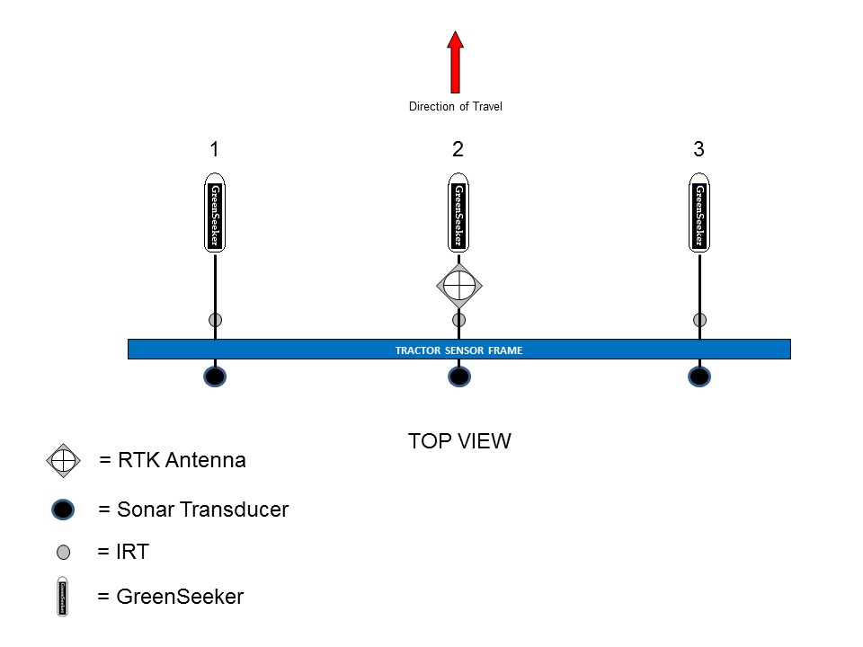

# Protocols for PhenoTractors

    Authors:

## Abstract

## Materials

### Tractor

### Sensors

#### Sonar Transducer

#### GreenSeeker Multispectral Radiometer

#### Infrared Thermal Sensor

## Methods

### Georeferencing

#### Computing sensor location from sensor offset + tractor direction

### Calibration

## References

Andrade-Sanchez, Pedro, Michael A. Gore, John T. Heun, Kelly R. Thorp, A. Elizabete Carmo-Silva, Andrew N. French, Michael E. Salvucci, and Jeffrey W. White. "Development and evaluation of a field-based high-throughput phenotyping platform." Functional Plant Biology 41, no. 1 (2014): 68-79. [doi:10.1071/FP13126](http://dx.doi.org/10.1071/FP13126)
